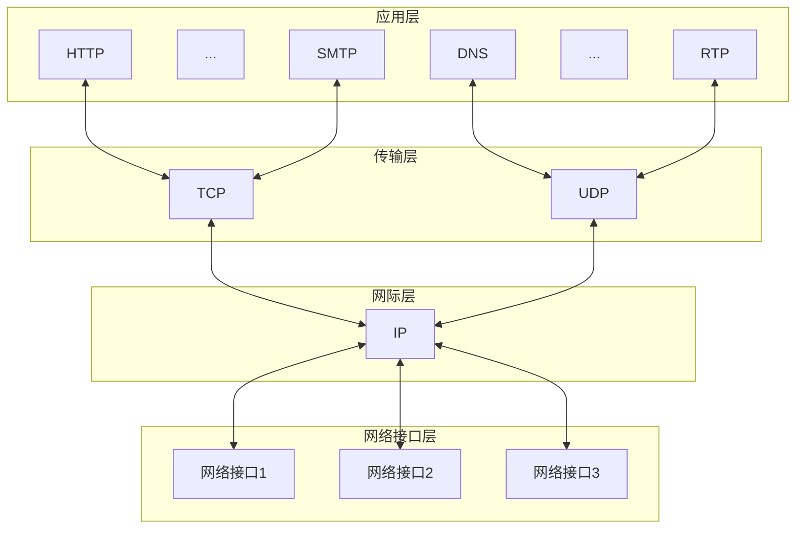

## 计算机网络概述

### 计算机网络的概念

1. 计算机网络 (网络): 由若干结点 (node, 节点)和连接这些结点的链路 (link)组成.
   1. 结点: 计算机, 集线器, 交换机或路由器等.
2. 网络直接可以通过路由器互连, 构成更广的互连网 (internet).
3. internet (互连网) 和 Internet (互联网/因特网)
   1. internet: 通用名词, 泛指多个计算机网络互连组成的计算机网络, 可使用任意通信协议.
   2. Internet: 专有名词, 指全球最大,开放的由众多网路和路由器互连而成的特定计算机网路, 采用 TCP/IP 协议族作为通信规则.

### 计算机网络的组成

#### 组成部分

1. 硬件
   1. 主机: 端系统
   2. 通信链路: 双绞线, 光纤, ...
   3. 交换设备: 路由器, 交换机, ...
   4. 通信处理机: 网卡, ...
2. 软件: 实现资源共享的软件和方便用户使用的各种各样的工具软件.
3. 协议: 计算机网络的核心, 规定网络传输数据时遵循的规范.
   
#### 工作方式

1. 边缘部分: 所有连接到互联网上的主机, 用来进行通信 (传输数据)和资源共享.
2. 核心部分: 大量网络和连接网络的路由器组成, 为边缘部分提供连通性和交换服务.

#### 功能组成

1. 通信子网: 实现联网计算机之间的数据通信
   1. 传输介质
   2. 通信设备
   3. 网络协议
2. 资源子网: 实现资源共享功能的设备及软件的集合
   1. 硬件资源
   2. 软件资源
   3. 数据资源

### 计算机网络的功能

1. 数据通信: 最基本最重要的功能
2. 资源共享: 提高资源的利用率
3. 分布式处理: 利用网络中空闲的计算机资源提高整个系统的利用率
4. 提高可靠性: 网络中的计算机可通过网络互为替代机
5. 负载均衡

### 电路交换, 报文交换与分组交换

#### 电路交换

> e.g.传统电话网.

1. 电路交换过程
   1. 建立连接: 数据传输前, 两个节点必须建立一条专用(双方独占)的物理通信路径.
   2. 数据传输: 数据传输期间, 物理通信路径始终被用户独占.
   3. 连接释放
2. 优点
   1. 通信延时小: 通信线路专用, 数据直达
   2. 有序传输: 顺序传送数据
   3. 没有冲突: 不同的通信双方拥有不同的信道
   4. 适用范围广: 模拟信号, 数字信号均可传输
   5. 实时性强: 物理通路建立后, 可随时通信
   6. 控制简单: 交换设备控制均较简单
3. 缺点
   1. 建立连接时间长: 平均连接建立时间对计算机通信来说太长了
   2. 线路利用率低: 物理通路被双方独占, 即使空闲也无法供其他用户使用
   3. 灵活性差: 物理通路中出现故障, 必须重新拨号建立新的连接
   4. 难以规格化: 不同类型, 不同规格, 不同速率的终端很难互相通信
   5. 难以实现差错控制: 中间结点不具有存储和校验数据的能力, 无法发现并纠正错误
   > 通路上的结点都直接接收并发送数据, 不存在存储转发的时间消耗.

#### 报文交换

1. 数据交换单位: 报文 message (用户数据 + 源地址 + 目的地址 + 其他信息)
2. 采用**存储转发技术**: 整个报文传送到相邻结点后, 全部存储后查找转发表, 转发给下一个结点, 重复至到达目的结点.
3. 优点
   1. 无须建立连接: 通信前无须建立连接, 可以随时发送报文
   2. 动态分配路线: 交换设备存储报文后, 选择合适的空闲线路转发报文
   3. 线路可靠性高: 如某条线路发送故障, 可选择其他可用线路
   4. 线路利用率高: 报文只在线路上传输时才占用链路的通信资源
   5. 提供多目标服务: 一个报文可以发给多个目的地址
4. 缺点
   1. 转发延时高: 接收完整报文才能查找转发表转发给下一个结点
   2. 缓存开销大: 报文大小没有限制, 交换结点需要有较大缓存空间
   3. 错误处理低效: 报文较大时, 发送错误的概率也越大, 重传整个报文的代价也更大

#### 分组交换

1. 数据交换单位: 分组 packet
2. 采用**存储转发技术**: 源结点发送数据前, 先将报文划分成若干等长数据段, 在数据段前添加必要控制信息 (源地址, 目的地址和编号信息等)组成的**首部**, 构成分组. 源结点将分组发送到分组交换网中, 分组交换机接收到一个分组后, 先从首部中提取目的地址, 查找转发表, 将分组转发给下一个分组交换机, 如此重复至到达目的结点.
3. 优点
   1. 无建立时延: 无须建立连接, 可随时发送分组
   2. 线路利用率高: 只在线路上传输时才占用链路的通信资源
   3. 简化存储管理: 分组长度固定, 缓冲区的大小也固定
   4. 加速传输: 分组逐个传输, 传输操作可以并行, **流水线方式**减少了报文传输时间. 分组所需的缓冲区大小比报文所需的小很多, 因缓冲区大小不足而等待发送的概率和时间也少很多.
   5. 减小了出错概率和重发数据量: 分组较短, 出错概率更小, 重发代价也小.
4. 缺点
   1. 存在存储转发时延
   2. 需要传输额外的信息量: 每个数据段都要加上首部, 增加了处理的时延
   3. 当分组交换⽹采⽤数据报服务时, 可能出现失序、丢失或重复分组的情况, 分组到达⽬的结点时, 要对分组按编号进⾏排序等⼯作, ⽽这些⼯作很麻烦. 若采⽤虚电路服务, 则虽然没有失序问题, 但有呼叫建⽴, 数据传输和虚电路释放三个过程.

### 计算机网络的分类

#### 分布范围

1. 广域网 WAN: 长距离通信, 直径几十到几千公里的覆盖范围, 是互联网的核心部分, 使用高速链路, 有较大的通信容量.
2. 城域网 MAN: 覆盖几个街区或整个城市, 直径 5~50 公里的覆盖范围.
3. 局域网 LAN: 直径几十米到几公里的覆盖范围, 使用广播技术.
4. 个人区域网 PAN: 使用无线技术连接, 也称为无线个人局域网 WPAN.

#### 传输技术

1. 广播式网络: 共享一个公共通信信道, 一台计算机发送报文分组, 其他所有计算机都会收到这个分组, 根据目的地址来决定自己是否接收. 局域网, 广域网中的无线, 卫星通信网络采用广播式通信技术.
2. 点对点网络

#### 拓扑结构

1. 总线形网络: 单根传输线把计算机连接起来.
   1. 优点
      1. 建网容易
      2. 增减结点方便
      3. 节省线路
   2. 缺点
      1. 重负载时通信效率不高
      2. 总线任意一处对故障敏感
2. 星形网络: 每个终端/计算机都单独与中央设备相连. 中央设备一般为交换机/路由器.
   1. 优点: 便于集中管理
   2. 缺点
      1. 成本高
      2. 中央设备对故障敏感
3. 环形网络: 所有计算机结构设备连接成一个环. 单环, 双环均可. 环中信号是**单向**的.
    > e.g.令牌环局域网
4. 网状网络: 每个结点至少有两条路径与其他结点相连.
   1. 优点: 可靠性高
   2. 缺点
      1. 控制复杂
      2. 线路成本高

> 星形, 总线性和环形网络多用于局域网.  
> 网状网路网络多用于广域网.

#### 使用者

1. 公用网 Public Network
2. 专用网 Private Network

#### 传输介质

1. 有线网络
   1. 双绞线网络
   2. 同轴电缆网络
   3. ...
2. 无线网络
   1. 蓝牙
   2. 微波
   3. 无线电
   4. ...

### 计算机网络的性能指标

1. 速率 Speed
   - 传送数据的速率, 也称数据传输速率, 数据传输率, 数据率或比特率.
   - 单位: b/s(bps), kb/s(k=$10^3$), Mb/s(M=$10^6$), Gb/s(G=$10^9$)
2. 带宽 Bandwidth
    - 原本表示通信信路允许通过的信号频率, 单位: 赫兹 Hz
    - 计算机网路中表示网络的通信线路所能传送数据的能力, 是数字信道所能传送的"最高数据传输速率", 单位: b/s
3. 吞吐量 Throughput
    - 单位时间内通过某个网络 (或信道,接口)的实际数据量. 
4. 时延 Delay
    - 数据 (报文/分组)从网路 (或链路)的一端传送到另一端所需的总时间.  
    $$总时延 = 发送时延 + 传播时延 + 处理时延 + 排队时延$$
    1. 发送时延/传输时延: 结点将分组的所有比特推向链路所需的时间, 即把分组全都发出去所用的时间 (从第一个比特开始发送,到最后一个比特发送完毕).  
    $$发送时延 = \dfrac{分组长度}{发送速率}$$
    2. 传播时延: 电磁波在信道(传输介质)中传播需要的时间, 即一个比特从一端到另一端所需要的时间.  
    $$传播时延=\dfrac{信道长度}{电磁波在信道上的传播速率}$$
    3. 处理时延: 数据在交换结点为了存储转发的处理所需要的时间, 比如分析首部, 从分组提取数据, 差错检验或者查找合适的路由等.
    4. 排队时延: 分组进入路由器后排队等待处理(确定转发端口, 等待转发).  
    > 处理时延和排队时延通常忽略不计, 除非特殊说明.
5. 时延带宽积: 发送端发送的第一个比特即将到达终点时, 发送端已发送了多少比特. 也称为*以比特为单位的链路长度*.  
    $$时延带宽积 = 传播时延 \times 信道带宽$$
6. 往返时延 Round-Trip Time, RTT: 从发送端发出第一个短分组, 到发送端收到接收端的确认(接收后立即确认)的时间. 互联网中, RTT 包括中间结点的处理时延, 排队时延和转发数据的发送时延.
7. 信道利用率: 有多少时间信道是有数据通过的.  
    $$信道利用率 = \dfrac{有数据通过的时间}{有无数据通过的总时间}$$

## 计算机体系结构与参考模型

### 计算机网络分层结构

体系结构(Architecture) 是体系的结构的实现.

分层的基本原则:

1. 每层实现一种**相对独立**的功能.
2. 层间的**接口清晰**, 减少交流.
3. 上下层独立, 上层单向使用下层提供的服务.
4. 分层结构促进**标准化工作**.

`实体`: 任何可发送/接受信息的硬件/软件进程 (软件模块).

`对等层`: 不同机器的同一层.
   > 对等层在逻辑上有一条直接信道.
`对等实体`: 同一层的实体. 
   > 第 `n` 层实体: 第 `n` 层的活动元素.  
   > 第 `n` 层为第 `n+1` 层提供服务.

**协议数据单元** Protocol Data Unit, **PDU**: 对等层的数据单元. 第 `n` 层的 PDU, 记为 `n-PDU`.  
**服务数据单元** Service Data Unit, **SDU**: 传送的数据.  
**协议控制信息** Protocol Control Information, **PCI**: 控制协议操作的信息.

每层的 PDU 有不同的名称: 物理层-`比特流`, 数据链路层-`帧`, 网络层-`分组`, 传输层-`报文段`.  

每层只能调用相邻下一层的服务, 并向上一层提供当前层及以下所以的服务总和.

### 协议, 接口, 服务

#### 协议

1. 语法: 数据与控制信息的格式.
2. 语义: 发出什么信息, 完成什么动作和想要什么应答.
3. 同步/时序: 事件实顺序的详细说明.

#### 接口

**服务访问点** Service Access Point, **SAP**.

数据链路层-`类型`, 网络层-`协议`, 传输层-`端口号`.

#### 服务

四类**服务原语**: 

请求 Request $\xLeftrightarrow[]{无应答}$ 指示 Indication

响应 Response $\xLeftrightarrow[]{有应答}$ 证实 Confirmation

协议是**水平**的, 服务是**垂直**的.

**可靠服务**: 有纠错, 检错, 应答机制, **保证正确**.  
**不可靠服务**: **尽可能保证正确**.

有/无应答服务.

### ISO/OSI 参考模型和 TCP/IP 模型

#### ISO/OSI 参考模型

开放系统互连参考模型 Open Systems Interconnect Reference Model, OSI/RM

|子网|层级|
|:--:|:--:|
|资源子网|[应用层](#应用层-application-layer) [表示层](#表示层-presentation-layer) [表示层](#表示层-presentation-layer) [会话层](#会话层-session-layer)|
|承上启下|[传输层](#传输层-transport-layer)|
|通信子网|[网络层](#网络层-network-layer) [数据链路层](#数据链路层-data-link-layer) [物理层](#物理层-physical-layer)|

##### 物理层 Physical Layer

**数据终端设备** Data Terminal Equipment, **DTE**  
**数据通信设备** Data Communication Equipment, **DCE**

物理层规定物理设备的规格, 机械形状和尺寸, 交换电路的数量和排列等.
> 物理设备在物理层以下.

##### 数据链路层 Data Link Layer

**传输单位**: `帧`.

**功能及作用**: 加强物理层传输原始比特流.

**典型协议**: `SDLC`, `HDLC`, `PPP`, `STP` 和`帧中继`等.

##### 网络层 Network Layer

**传输单位**: `数据报`.

**功能及作用**: 

   - 将网络层的分组从`源结点`传输到`目的结点`. 
   - 对分组进行`路由选择`, `流量控制`, `拥塞控制`, `差错控制`和`网际互连`等.

**典型协议**: `IP`, `IPX`, `ICMP`, `IGMP`, `ARP`, `RAPR`, `RIP` 和 `OSRF` 等.

##### 传输层 Transport Layer

**功能及作用**: 
   - `主机`与`主机`间 (端到端)的通信. 
      > 数据链路层提供`点到点通信`, 用`硬件地址`或 `IP 地址`标识为一个点.  
      > `端到端通信`是用`端口`标识`进程`.
   - 为连接提供`流量控制`, `差错控制`, `服务质量`, `数据传输管理`等.
   - 传输层屏蔽, 高层看不到通信子网的变化. 
   - 复用: 多个应用可同时使用传输层服务.
   - 分用: 传输层可以分别交付信息给上层应用进程.

**典型协议**: `TCP`, `UDP`.

##### 会话层 Session Layer

**功能及作用**: 
   - 为表示层的实体或用户有序地传输, 即**建立同步(SYN)**.
   - 管理主机间的会话进程, `建立`, `管理`和`终止`.
   - `检查点`实现`断点下载`.

##### 表示层 Presentation Layer

**功能及作用**: 
   - 采用抽象的标准方法定义数据结构, 并采用标准的编码形式.
   - `数据压缩`, `加解密`.

##### 应用层 Application Layer

用户与网络的接口.

**典型协议**: `FTP`, `SMTP`, `HTTP`.

#### TCP/IP 模型

|TCP/IP|OSI/RM|
|:----:|:----:|
|应用层|应用层+表示层+会话层|
|传输层|传输层|
|网际层|/|
|网络接口层|数据链路层+物理层|

##### 网际层

`主机`-`主机`

定义了标准的分组格式和协议, 即 `IP`.

##### 传输层

`应用`-`应用`/`进程`-`进程`

1. **传输控制协议** Transmission Control Protocol, **TCP**
   - 面向连接的协议. 必须先建立连接, 才能提供可靠交付.
   - 传输单位: `报文段`
2. **用户数据报协议** User Datagram Protocol, **UDP**
   - 无连接的, 尽可能交付.
   - 传输单位: `用户数据报`

##### 应用层

`用户`-`用户`

高层协议.

- 虚拟终端协议 `Telnet`
- 文件传输协议 `FTP`
- 域名解析服务 `DNS`
- 电子邮件协议 `SMTP`
- 超文本传输协议 `HTTP`

#### TCP/IP 模型与 OSI 参考模型的比较

|TCP/IP|OSI/RM|
|:----:|:----:|
|没有明确区分|精确定义: `服务`, `协议`和`接口`|
|先有协议, 后有模型, 不适用其他网络模型|先有模型, 后有协议规范, 通用性好|
|**可靠性**是**端-端**的问题. `网际层`仅有**无连接**的通信. `传输层`支持**无连接**和**面向连接**.|`网络层`支持**无连接**和**面向连接**. `传输层`仅支持**面向连接**的通信.|