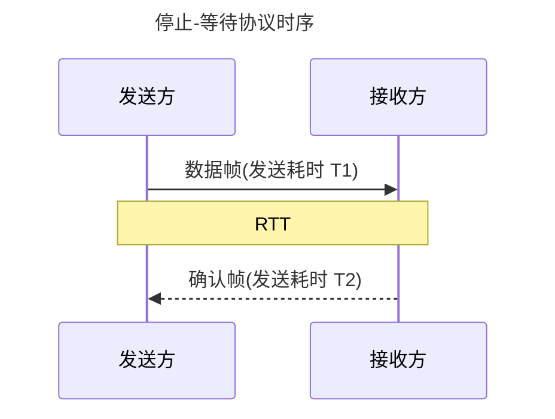

## 基本概念和功能

`物理链路`: 从一个节点到相邻节点的一段物理线路 (有线或无线), 而中间没有任何其他的交换节点.  
`数据链路`: 把实现通信协议的硬件和软件加到物理链路上.
> 常用`网络适配器` (既有硬件, 也有软件)来实现.

计算机通过`网络适配器`来连接外界局域网.

适配器在接收和发送各种帧时, 不使用计算机的CPU. 这时计算机中的CPU可以处理其他任务. 
> 计算机的硬件地址 (MAC地址)就在适配器的ROM中, 而计算机的软件地址-IP地址, 则在计算机的存储器中.
- 当适配器收到有差错的帧时, 就把这个帧直接丢弃而不必通知计算机. 
- 当适配器收到正确的帧时, 它就使用中断来通知该计算机, 并交付给网络层. 
- 当计算机要发送 IP 数据报时, 就把 IP 数据报向下交给适配器, 组装成帧后发送到局域网. 

两种信道

`点对点信道`: 一对一通信.
`广播信道`: 一对多通信. (必须使用共享信道协议)

## 基本任务

### 封装成帧

将网络层的`IP数据报`作为数据, 前后加上`帧首部`和`帧尾部`封装成`帧`.

`帧首部`和`帧尾部`的作用:

1. 确定帧界限
    - Start Of Header, `SOH` 帧开始 (`00000001B`)
    - End Of Transmission, `EOT` 帧结束 (`00000100B`)
2. 记录必要的控制信息

最大传输单元 MTU (Maximum Transfer Unit): 协议规定所能传送数据部分的长度.

### 透明传输

#### 字节传输法

如果发送数据中出现了与`SOH`或`EOT`相同的数据, 即`00000001B`或`00000100B`, 则通过增加**转义字符** `ESC` (`00011011B`)来区别. 如果与转义字符相同, 则再增加一个 `ESC`.

接收时, 将 `ESC` 部分去掉即可.

#### 字符计数法

通过在第一个字节记录帧的字节数 (包括计数这个字节).

当计数字段出现错误时, 会导致接收方错误识别该帧, 继而导致错误读取下一帧的开始位置. 

#### 零比特填充的首尾标志法

使用连续的 6 个 $1$ (`01111110`)作为开始和结束. 数据部分不允许出现连续的 6 个 $1$.

发送数据时, 若出现连续的 5 个 $1$, 则插入一个 $0$.  
接收数据时, 若收到连续的 5 个 $1$, 则将后面的 $0$ 去掉.

#### 违规编码法

曼彻斯特编码中不存在, 高电平保持和低电平保持. 所以数据部分不会出现这样的违规编码.

> 这种方法需要编码有冗余, 可以用数据部分不会出现的违规编码来标志开始和结束.

### 差错检测

#### 检错编码

检错编码: 可以用于判断当前数据是否发生错误.

##### 奇偶校验码

奇校验码: 补 $1$ / $0$ 使得数据 $1$ 的个数为奇数.
偶校验码: 补 $1$ / $0$ 使得数据 $1$ 的个数为偶数.

> $n$ 个数据, 则校验 $n+1$ 的 $1$ 的个数.

|原数据|奇校验|偶校验|
|:---|:---|:---|
|`00000`|`100000`|`000000`|
|`1111111`|`01111111`|`11111111`|
|`101110`|`1101110`|`0101110`|
|`10001000`|`110001000`|`010001000`|

对于奇校验, 数据异或的结果为 $0$ 代表检测出错误.
对于偶校验, 结果为 $1$ 代表检测出错误.

:::warning
出现偶数个错误, 则无法检测.
:::

##### 循环冗余码

循环冗余码 Cyclic Redundancy Check, CRC

在一个待发送的 $n$ 位的二进制数据序列之后附加一个 $r$ 位的校验码再发送出去, 共发送 $n+r$ 位数据.

1. 发送方和接收方事先商定一个长度 $r+1$ 的除数 $P$. 

    例如, 除数 $P=1101B$. 除数对应的生成多项式为 $P(X) = x^3 + x^2 + x^0$, 最高次幂为 3, 则为 3 阶.

2. 计算帧校验序列 FCS

    生成多项式阶数为 $r$.

    在原始数据后添加 $r$ 个 $0$ 作为被被除数.  
    除法中的上下直接进行异或.  
    最后得到的 $r$ 位余数即为 FCS. 

    将 FCS 拼接在原始数据后发送.

3. 接收方再用接收到的数据除以 $P$. 

    若余数为 $0$, 则数据正确, 反之错误.

#### 纠错编码

纠错编码: 不仅可以判断当前数据是否发生错误, 还能确定错误发生的位置. 

##### 海明码

原始数据有 $k$ 位, 需要添加 $r$ 个校验位. $r$ 必须满足: $2^r \geq k + r + 1$

$2^3 \geq 4 + 3 +1$, 4 位原始数据, 则需要 3 位校验位. 

海明码由原始数据 $D_i$ 和校验位 $P_j$ 组成. 

校验位留出 2 的幂次方的位置: 2, 4, 8, ...

将原始数据分为 $r$ 组. 

|1|2|4|...|
|:-:|:-:|:-:|:-:|
|`001`|`010`|`100`|...|
|`**1`|`*1*`|`1**`|...|

将海明码 $k+r$ 位按二进制根据上面的表进行匹配 $1$ 的位置.  
例如, 7 = `111B`: 
    
- 第一个 `1` 与 4 的 `1**` 匹配, 属于 4 的分组; 
- 第二个 `1` 与 2 的 `*1*` 匹配, 属于 2 的分组; 
- 第三个 `1` 与 1 的 `**1` 匹配, 属于 1 的分组.

以此类推, 7 位海明码分组如下:

|1|2|4|
:-:|:-:|:-:|
|`**1`|`*1*`|`1**`|
|`001` (1)|`010` (2)|`100` (4)|
|`011` (3)|`011` (3)|`101` (5)|
|`101` (5)|`110` (6)|`110` (6)|
|`111` (7)|`111` (7)|`111` (7)|

纠错:

计算每个分组的奇偶校验码. 奇偶校验码全为 0, 则未出错. 若出错, 可按下表的方式进行纠错:

|S3|S2|S1|出错位置|
|:-:|:-:|:-:|:-:|
|0|0|0|未出错|
|0|0|1|H1|
|0|1|0|H2|
|0|1|1|H3|
|1|0|0|H4|
|1|0|1|H5|
|1|1|0|H6|
|1|1|1|H7|

::: details Example

原始数据: `1100`

|H7|H6|H5|H4|H3|H2|H1|
|:-:|:-:|:-:|:-:|:-:|:-:|:-:|
|1|1|0|P3|0|P2|P1|

分组:

1. `H1` `H3` `H5` `H7`
2. `H2` `H3` `H6` `H7`
3. `H4` `H5` `H6` `H7`

H1 = P1 = H3 $\oplus$ H5 $\oplus$ H7 = 0 $\oplus$ 0 $\oplus$ 1 = 1  
H2 = P2 = H3 $\oplus$ H6 $\oplus$ H7 = 0 $\oplus$ 1 $\oplus$ 1 = 0  
H4 = P3 = H5 $\oplus$ H6 $\oplus$ H7 = 0 $\oplus$ 1 $\oplus$ 1 = 0

完整的海明码:  

|H7|H6|H5|H4|H3|H2|H1|
|:-:|:-:|:-:|:-:|:-:|:-:|:-:|
|1|1|0|0|0|0|1|

接收后进行纠错:

S1 = H1 $\oplus$ H3 $\oplus$ H5 $\oplus$ H7 = 1 $\oplus$ 0 $\oplus$ 0 $\oplus$ 1 = 0  
S2 = H2 $\oplus$ H3 $\oplus$ H6 $\oplus$ H7 = 0 $\oplus$ 0 $\oplus$ 1 $\oplus$ 1 = 0  
S3 = H4 $\oplus$ H5 $\oplus$ H6 $\oplus$ H7 = 0 $\oplus$ 0 $\oplus$ 1 $\oplus$ 1 = 0

S1 = S2 = S3 = 0, 所以未出错.

:::

`海明距离`/`码距`: 两个码字之间不同的比特数.

::: details Example
$101010 \oplus 011110 = 110100$  
$110100$ 中有三个 $1$, 则码距为 $3$.
:::

一个有效集的海明距离: 任意两个码字的海明距离的最小距离.

::: details Example
$(00,01,10,11)$ 的海明距离为 $1$.  
$(000,110,011,101)$ 的海明距离为 $2$.
:::

海明距离与编码的检错和纠错能力有关.  

1. 检错能力

    $e$ 位数据, 至少要 $e+1$ 的海明距离.  
    当数据发生小于 $e$ 位的错误时, 也不会变成另外的有效编码.

    > $(000,110,011,101)$ 中的 $110$ 的任意一位发生错误, 即 $010$,$100$,$111$ 都不是有效编码.

2. 纠错能力

    $t$ 位错误, 至少要 $2t+1$ 的海明距离.  
    当数据发生 $t$ 位的错误时, 错误编码与原来的码字海明距离为 $t$, 与其他码字的海明距离至少为 $t+1$.

    ::: details Example

    $(000100, 011101, 111010)$ 中 $000100$ 变成 $000101$.
    
    |码字|与 $000101$ 的 海明距离|
    |:---:|:---:|
    |$000100$|$1$|
    |$011101$|$2$|
    |$111010$|$6$|
    
    与 $000101$ 最近的码字还是 $000100$.

    :::

### 传输差错

在数据链路层若仅仅使用循环冗余检验 CRC 差错检测技术，则只能做到对帧的无差错接受.  
接收端只能保证接收到的帧没有错误, 但**不是所有帧都正确接收**.

1. 比特差错
2. 帧差错
    
    - 帧丢失
    - 帧重复
    - 帧失序

在 CRC 的基础上增加了`帧编号`, `确认`和`重传机制`.
发送端在一定的期限内若没有收到对方的确认, 就认为出现了差错, 因而就进行重传, 直到收到对方的确认为止. 

对于通信情况好的**有线线路**, 数据链路层可以不使用确认和重传机制, 不用上层提供可靠传输.  
对于通信情况差的**无线线路** 数据链路层需要使用确认和重传机制.

## 流量控制

### 停止-等待流量控制法

1. 发送方每次只能发送一帧
2. 接收方接收到该帧后, 发回一个应答信号给发送方
3. 发送方接**收到应答信号后**才可以发送下一帧
4. 若发送方没有接收到接收方发回的应答信号, 则需要**一直等待**

### 滑动窗口流量控制

数据链路中的发送方和接收方, 分别维护一个`发送窗口`和一个`接收窗口`.

`发送窗口` 限制了可以发送的未经确认的最大数.

### 信道利用率

$$信道利用率 U = \dfrac{发送数据的时间}{一个发送周期的总时间} = \dfrac{数据发送}{T_1+RTT+T_2}$$

$$有效传输速率 v_e = \dfrac{一个发送周期的数据量}{一个发送周期的总时间}$$

> RTT 一般大于 $T_1 + T_2$.

### 可靠传输机制

1. 确认: 每当接收方收到发送方发来的数据帧, 都需要向发送方发回一个确认帧.

2. 超时重传: 当发送方发送某一帧后, 在规定的时间内没有收到接收方返回的确认帧, 就会认为接收方没有收到, 发送方需要重发该帧. 超时重传是通过给每一帧设置一个超时计时器实现的.

可靠传输协议机制协议 Automatic Repeat reQuest, ARQ
> 接收方不需要请求, 发送方自动重传.

#### 停止-等待协议

|情况|错误|处理方法|
|:--:|:--|:--|
|发送方数据出错/丢失|<ul><li>发送数据丢失</li><li>数据出错</li></ul>|直接等待超时重传.|
|接收方确认丢失|接收方发送的确认帧丢失|发送方重传, 接收方返回确认帧.    接收方即使之前已经收到数据, 也发送确认帧.|
|接收方确认迟到|确认帧在超时后到达|发送方会等待下一个确认帧, 再收到重复的确认帧直接丢弃.|

#### 后退 N 帧协议

后退 N 帧协议 Go Back N, GBN.

发送方可以在未收到确认帧的情况下, 将序号在发送窗口范围内的多个帧全部发送出去.

接收方在连续收到多个正确的数据帧之后直接对最后一帧发回确认信息, 则代表之前收到的数据帧都是正确的.

发送方一次发送 `F0`-`F4` 5 个帧, 若接收方 5 个帧均正确, 则发送 `F4` 的确认帧作为`F0`到`F4`的累积确认.

接收方检测到数据帧出错后, 会直接丢弃错误帧和之后收到的所有序号比错误帧大的帧, 直到发送方的计时器超时, 重传正确的数据帧. 

这个协议协议中, 发送方的发送窗口大于 1, 但接收方的接收窗口只有 1.

#### 选择重传协议

选择重传协议 Selective Repeat, SR

与后退 N 帧协议区别在于, 不需要发送方重复发送一组数据帧. 接收方仅请求出错的帧即可.

#### 连续 ARQ 的信道利用率 (GBN, SR)

1. $nT_1 < T_1+T_2+RTT$, 一个发送周期内能发送 n 帧.

    $$信道利用率 U = \dfrac{nT_1}{T_1 + T_2 + RTT}$$

2. $nT_1 \geq T_1+T_2+RTT$, 一个发送周期内不能发送 n 帧.

    $$信道利用率 U = 1$$