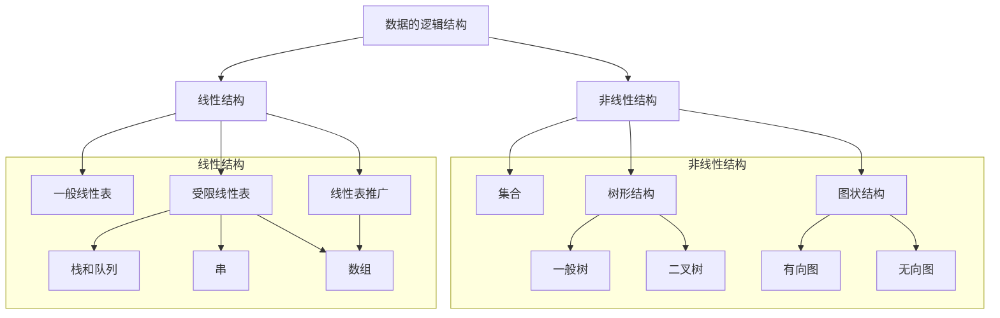

## 数据结构的基本概念

1. 数据: 信息载体, 能够输入给计算机进行处理.
2. 数据元素: 数据的基本单位. 一个`数据元素`可由若干个`数据项`组成.
3. 数据对象: 具有相同性质的数据元素的集合.
4. 数据类型:  

   - 原子类型: *不可再分割*的数据类型.
   - 结构类型: 可以分解成若干*成分*/分量的数据类型.
   - 抽象数据类型: 对数据的抽象定义, 包括*数据的取值范围*和*结构形式*, *对数据的操作*.

5. 数据结构: 一种或多种数据元素之间的特定关系, 包括*逻辑结构*, *存储结构*和*数据的运算*.

### 数据结构三要素

#### 数据的逻辑结构



- 集合:同属于一个集合．
- 线性结构：　元素间只存在一对一的关系．
- 树状结构：　元素间存在一对多的关系．
- 网状结构：　元素间存在多对多的关系．

#### 数据的存储结构

| 存储方式 | 描述 | 优点 | 缺点 |
| :---: | :---: | :--- | :--- |
| **顺序存储** | 逻辑相邻, 物理位置也相邻。 | - 随机存取 <br> - 占用最少的空间 | - 需要一整块存储相邻的元素<br>- 可能产生较多空间碎片 |
| **链式存储** | 随机存储, 通过指针来表示逻辑关系。 | - 充分使用空间 | - 指针占用额外的空间<br>- 只能顺序存取 |
| **索引存储** | 建立索引表, 通过`索引项(关键字+地址)`进行检索。 | - 检索速度快 | - 索引表占用额外空间<br>- 增删索引表会花费较多时间 |
| **散列/Hash存储** | 根据关键字计算存储位置。 | - 检索和增删速度都很快 | - 散列函数不好可能会`撞Hash`<br>- 解决冲突会增加时间和空间开销 |

#### 数据的运算

运算的定义针对逻辑结构, 指出`运算的功能`.  
运算的实现针对存储结构, 指出`运算的具体操作`.

## 算法和算法评价

1. 重要特性

   1. `有穷性`: 有穷的步骤, 有穷的执行时间.
   2. `确定性`: 相同输入 $\rightarrow$ 相同输出.
   3. `可行性`: 可通过基本运算的有限次来实现.
   4. `输入`: 0 或 n 个输入.
   5. `输出`: 1 或 n 个输出.

2. 好算法的目标

   1. `正确性`: 正确的解决问题.
   2. `可读性`: 良好的可读性, 帮助理解.
   3. `健壮性`: 对非法数据有合理的处理.
   4. `高效率于低存储量的需求`: 时间复杂度和空间复杂度.

### 算法度量

#### 时间复杂度

计算**最深层循环**中语句的重复频率. 记为: $T(n) = O(f(n))$.

   > $O()$ 表示数量级.  

- 最坏复杂度:　最坏情况的执行时间．*(般考虑最坏复杂度)*
- 平均复杂度：　所有情况等概率发生的执行时间．
- 最好复杂度：　最好情况的执行时间．

$O(1) < O(log_2 n) < O(n) < O(nlog_2 n) < O(n^2) < O(n^3) < 2^n < O(n!) < O(n^n)$

##### 时间复杂度计算

1. 算法嵌套

   ```python
   def c():
      a(b())
   ```

   $T(c()) = O(a) \times O(b)$

2. 算法串行

   ```python
   def c():
      a()
      b()
   ```

   $T(c()) = O(a) + O(b)$

#### 空间复杂度

算法中**除了输入和程序以为所需额外的存储空间**, 记为: $S(n) = O(g(n))$.

**Example**

常数空间复杂度(`原地工作`): 算法需要的辅助空间为常量, 即 $O(1)$.

   ```python
   def add(a, b):
   # 只分配了一个变量来存储结果
   sum = a + b
   return sum
   ```

线性空间复杂度: 输入数据的大小 `n` 呈线性增长

   ```python
   def create_array(n):
      arr = []
      for i in range(n):
         # 列表的长度随着 n 的增大而增大
         arr.append(i)
      return arr
   ```
