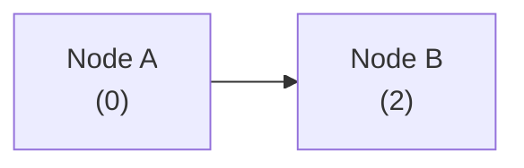
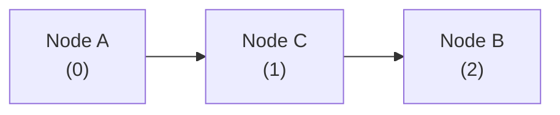
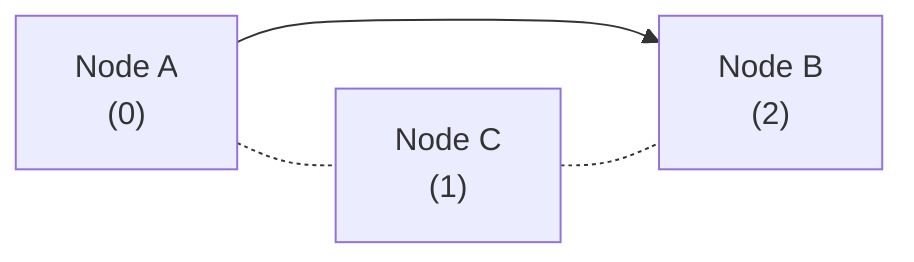

## 数组

`数组(array)` 是线性数据结构, 相同类型的元素存在连续的空间中. 用 `索引(Index)` 来记录元素的位置.

### 常用操作

#### 初始化数组

两种初始化方式: 无初始值, 给定初始值.
> 大部分语言在无初始值的情况下, 一般默认初始化为 `0`.

```python
arr: list[int] = [0] * 5 
# result: [0,0,0,0,0]
nums: list[int] = [1,2,3,4,5]
# result: [1,2,3,4,5]
```

#### 访问元素

通过索引来获得特定元素.

```python
# 访问元素
arr: int = arr[1]  # 访问索引 1 处的元素
# 更新元素
arr[1] = 0    # 将索引 1 处的元素更新为 0
```

$元素内存地址 = 数组内存地址 + 元素长度 \times 元素索引$
> 索引实际上是元素在内存中的偏移量.  

#### 插入元素

原来的数组元素都是连续存储的, 没有空位用于插入. 所以插入操作是 *将插入元素位置及以后的元素向后移动一位, 再插入元素*.
> 数组的长度是固定的, 所以插入一个元素, 必然会导致尾部元素"丢失".

```python
def insert(nums: list[int], num: int, index: int):
    """在数组的索引 index 处插入元素 num"""
    # 把索引 index 以及之后的所有元素向后移动一位
    for i in range(len(nums) - 1, index, -1):
        nums[i] = nums[i - 1]
    # 将 num 赋给 index 处的元素
    nums[index] = num
```

#### 删除元素

将删除元素位置以后的元素向前移动一位.

```python
def remove(nums: list[int], index: int):
    """删除索引 index 处的元素"""
    # 把索引 index 之后的所有元素向前移动一位
    for i in range(index, len(nums) - 1):
        nums[i] = nums[i + 1]
```

#### 遍历数组

```python
def traverse(nums: list[int]):
    """遍历数组"""
    count = 0
    # 通过索引遍历数组
    for i in range(len(nums)):
        count += nums[i]
    # 直接遍历数组元素
    for num in nums:
        count += num
    # 同时遍历数据索引和元素
    for i, num in enumerate(nums):
        count += nums[i]
        count += num
```

#### 查找元素

在数组中查找指定元素需要遍历数组, 每轮判断元素值是否匹配, 若匹配则输出对应索引.  
因为数组是线性数据结构, 所以上述查找操作被称为“线性查找”.  

```python
def find(nums: list[int], target: int) -> int:
    """在数组中查找指定元素"""
    for i in range(len(nums)):
        if nums[i] == target:
            return i
    return -1
```

#### 扩容数组

大部分语言中, 数组的长度是不可变的. 如果我们希望扩容数组, 则需重新建立一个更大的数组, 然后把原数组元素依次复制到新数组.  

```python
def extend(nums: list[int], enlarge: int) -> list[int]:
    """扩展数组长度"""
    # 初始化一个扩展长度后的数组
    res = [0] * (len(nums) + enlarge)
    # 将原数组中的所有元素复制到新数组
    for i in range(len(nums)):
        res[i] = nums[i]
    # 返回扩展后的新数组
    return res
```

### 特点

1. 优点
	1. 空间效率高: 使用连续内存块, 无额外结构开销.
	2. 支持随机访问: $O(1)$内访问任意元素.
2. 缺点
	1. 插入与删除的效率低: 数组长度较长时, 需要移动大量元素.
	2. 长度不可变
	3. 分配多余的空间会被浪费


## 链表

`链表(linked list)` 是线性数据结构, 各个节点通过引用相连(记录下一个节点的内存地址).

```python
class ListNode:
    """链表节点类"""
    def __init__(self, val: int):
        self.val: int = val               # 节点值
        self.next: ListNode | None = None # 指向下一节点的引用
```

节点可以分布在内存的任意位置.

`头节点`: 首个节点.
`尾节点`: 最后一个节点. (指向空, `null`/`None`)

链表比数组占用更多空间, 除了值外, 还需要保存地址.

### 常用操作

#### 初始化链表

```python
# 初始化链表 1 -> 3 -> 2 -> 5 -> 4
# 初始化各个节点
n0 = ListNode(1)
n1 = ListNode(3)
n2 = ListNode(2)
n3 = ListNode(5)
n4 = ListNode(4)
# 构建节点之间的引用
n0.next = n1
n1.next = n2
n2.next = n3
n3.next = n4
```

通常使用头节点来作链表的代称.

#### 插入节点

改变两个节点的指向即可.





```python
def insert(n0: ListNode, P: ListNode):
    """在链表的节点 n0 之后插入节点 P"""
    n1 = n0.next
    P.next = n1
    n0.next = P
```

#### 删除节点

删除元素的上一个节点指向删除元素的下一个节点即可.




```python
def remove(n0: ListNode):
    """删除链表的节点 n0 之后的首个节点"""
    if not n0.next:
        return
    # n0 -> P -> n1
    P = n0.next
    n1 = P.next
    n0.next = n1
```

#### 访问节点

需要逐个向后遍历.

```python
def access(head: ListNode, index: int) -> ListNode | None:
    """访问链表中索引为 index 的节点"""
    for _ in range(index):
        if not head:
            return None
        head = head.next
    return head
```

#### 寻找节点

也需要逐个向后遍历.

```python
def find(head: ListNode, target: int) -> int:
    """在链表中查找值为 target 的首个节点"""
    index = 0
    while head:
        if head.val == target:
            return index
        head = head.next
        index += 1
    return -1
```

### 数组 VS 链表

||数组|链表|
|:--:|:--:|:--:|
|存储方式|连续内存空间|分散内存空间|
|容量扩展|长度不可变|可灵活扩展|
|内存效率|元素占用内存少、但可能浪费空间|元素占用内存多|
|访问元素|$O(1)$|$O(n)$|
|添加元素|$O(n)$|$O(1)$|
|删除元素|$O(n)$|$O(1)$|

### 常见链表

1. 单向链表: 最常见的链表.
	```mermaid
	graph LR;
		1 --> 2 --> 3 --> 4 --> 5 --> None;
	```
2. 环形链表: `尾节点`指向`头节点`.
	```mermaid
	graph LR;
		1 --> 2 --> 3 --> 4 --> 5;
		5 --> 1;
	```
3. 双向链表: 元素记录上一个节点的地址和下一个节点的地址.
	```mermaid
    graph LR
        1 --> 2
        2 --> 3
        3 --> 4
        4 --> 5
        5 --> 4
        4 --> 3
        3 --> 2
        2 --> 1
	```
    > `1` 和 `5` 分别为两个方向的尾节点, 最后指向 `None`.

## 列表

`列表(list)` 是抽象数据类型, 是元素的有序集合. 

> `链表` 就是一个列表.  
> `数组` 是一个存在长度限制的列表.

### 常用操作

#### 初始化列表

```python
# 无初始值
nums: list[int] = []
# 有初始值
nums: list[int] = [1, 3, 2, 5, 4]
```

#### 访问元素

```python
# 访问元素
num: int = nums[1]  # 访问索引 1 处的元素
# 更新元素
nums[1] = 0    # 将索引 1 处的元素更新为 0
```

#### 插入与删除元素

在列表尾部添加/删除元素的时间复杂度为 $O(1)$, 其他情况与数组相同为 $O(n)$.

```python
# 清空列表
nums.clear()

# 在尾部添加元素
nums.append(1)
nums.append(3)
nums.append(2)
nums.append(5)
nums.append(4)

# 在中间插入元素
nums.insert(3, 6)  # 在索引 3 处插入数字 6

# 删除元素
nums.pop(3)        # 删除索引 3 处的元素
```

#### 遍历列表

```python
# 通过索引遍历列表
count = 0
for i in range(len(nums)):
    count += nums[i]

# 直接遍历列表元素
for num in nums:
    count += num
```

#### 拼接列表

```python
# 拼接两个列表
nums1: list[int] = [6, 8, 7, 10, 9]
nums += nums1  # 将列表 nums1 拼接到 nums 之后
```

#### 排序列表

```python
# 排序列表
nums.sort()  # 排序后，列表元素从小到大排列
```

### 列表实现

若插入元素时列表容量已满, 则需要进行扩容.

```python
class MyList:
    """列表类"""

    def __init__(self):
        """构造方法"""
        self._capacity: int = 10  # 列表容量
        self._arr: list[int] = [0] * self._capacity  # 数组（存储列表元素）
        self._size: int = 0  # 列表长度（当前元素数量）
        self._extend_ratio: int = 2  # 每次列表扩容的倍数

    def size(self) -> int:
        """获取列表长度（当前元素数量）"""
        return self._size

    def capacity(self) -> int:
        """获取列表容量"""
        return self._capacity

    def get(self, index: int) -> int:
        """访问元素"""
        # 索引如果越界，则抛出异常，下同
        if index < 0 or index >= self._size:
            raise IndexError("索引越界")
        return self._arr[index]

    def set(self, num: int, index: int):
        """更新元素"""
        if index < 0 or index >= self._size:
            raise IndexError("索引越界")
        self._arr[index] = num

    def add(self, num: int):
        """在尾部添加元素"""
        # 元素数量超出容量时，触发扩容机制
        if self.size() == self.capacity():
            self.extend_capacity()
        self._arr[self._size] = num
        self._size += 1

    def insert(self, num: int, index: int):
        """在中间插入元素"""
        if index < 0 or index >= self._size:
            raise IndexError("索引越界")
        # 元素数量超出容量时，触发扩容机制
        if self._size == self.capacity():
            self.extend_capacity()
        # 将索引 index 以及之后的元素都向后移动一位
        for j in range(self._size - 1, index - 1, -1):
            self._arr[j + 1] = self._arr[j]
        self._arr[index] = num
        # 更新元素数量
        self._size += 1

    def remove(self, index: int) -> int:
        """删除元素"""
        if index < 0 or index >= self._size:
            raise IndexError("索引越界")
        num = self._arr[index]
        # 将索引 index 之后的元素都向前移动一位
        for j in range(index, self._size - 1):
            self._arr[j] = self._arr[j + 1]
        # 更新元素数量
        self._size -= 1
        # 返回被删除的元素
        return num

    def extend_capacity(self):
        """列表扩容"""
        # 新建一个长度为原数组 _extend_ratio 倍的新数组，并将原数组复制到新数组
        self._arr = self._arr + [0] * self.capacity() * (self._extend_ratio - 1)
        # 更新列表容量
        self._capacity = len(self._arr)

    def to_array(self) -> list[int]:
        """返回有效长度的列表"""
        return self._arr[: self._size]
```