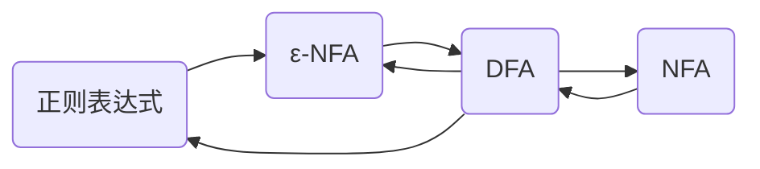

## 正则表达式

- 有穷自动机: 通过抽象机器装置扫描和接受字符串识别 (表示)正则语言.
- 正则表达式: 通过代数式表示或产生正则语言.
 > 正则表达式所表示的语言与正则语言等价.

### 基础

1. $\emptyset$ 是一个正则表达式, 表示空语言 $\emptyset$.
2. $\epsilon$ 是一个正则表达式, 表示语言 $\{\epsilon\}$.
3. 对于任意一个符号 $a$, $a$ 是一个正则表达式,表示语言 $\{a\}$, 具有一个长度为 1 的字符串.

### 归纳

1. 如果 $E_1$ 和 $E_2$ 是正则表达式, 那么 $E_1 + E_2$ 也是正则表达式, 且 $L(E_1 + E_2) = L(E_1) \cup L(E_2)$.
2. 如果 $E_1$ 和 $E_2$ 是正则表达式, 那么 $E_1 E_2$ 也是正则表达式, 且 $L(E_1 E_2) = L(E_1)L(E_2)$.
3. 如果 $E$ 是正则表达式, 则 $E^*$ 也是正则表达式.
4. 如果 $E$ 是正则表达式, 则 $(E)$ 也是正则表达式, 表示语言 $L(E)$.

### 计算优先级

|计算优先级|示例|
|:------:|:--:|
| () |$(E)$|
| * |$E^*$|
|$\cdot$|$E_1 E_2$ ($\cdot$ 可省略)|
| + |$E_1 + E_2$|

## 有穷自动机和正则表达式

对于一个 DFA 所能识别的语言, 都**存在**一个正则表达式表示它.  
任何一个正则表达式表示的语言, 都可以由一个 $\epsilon$-NFA 识别.

### DFA --> 正则表达式

定理: 若 $L = L(A)$ 是某 DFA $A$ 的语言, 那么存在正则表达式 $R$ 满足$L = L(R)$。

#### 递归法

$$A = (\{1,2,3,...,n\},\Sigma,\delta,1,F)$$

设正则表达式 $R_{i,j}^{(k)}$ 表示从 $i$ 到 $j$, 但中间节点状态编号不超过 $k$ 全部路径的字符串集 (简称 $k$-路径):

$$R_{i,j}^{(k)} = \{x \mid \hat{\delta}(i, x) = j, \text{x经过的状态除两端外都不超过} k\}$$

> $i$, $j$ 可以超过 $k$.  
> $k = 0$, 则中间没有经过节点.

1. $k = 0$
  
    1. 情况 1: $i \neq j$

      |$R_{i,j}^{(0)} = \epsilon$ |$R_{i,j}^{(0)} = a$|$R_{i,j}^{(0)} = a_1 + a_2 + \cdots + a_t$|
      |:----:|:----:|:----:|
      ||||

      2. 情况 1: $i = j$

      |$R_{i,j}^{(0)} = \epsilon$|$R_{i,j}^{(0)} = a + \epsilon$|$R_{i,j}^{(0)} = a_1 + a_2 + \cdots + a_t + \epsilon$|
      |:----:|:----:|:----:|
      ||||

2. $R_{i,j}^{(k)} = R_{i,j}^{(k-1)} + R_{i,k}^{(k-1)} (R_{k,k}^{(k-1)})^* R_{k,j}^{(k-1)}$

    - $R_{i,j}^{(k-1)}$: 不经过 $k$.
    - $R_{i,k}^{(k-1)}$: 首次从 $i$ 到 $k$.
    - $(R_{k,k}^{(k-1)})^*$: 1 或 n 次 $k$ 到 $k$.
    - $R_{k,j}^{(k-1)}$: 最后从 $k$ 到 $j$.

如果 1 是开始结点，则和 DFA 等价的正则表达式就是
$$\cup_{j \in F} R_{1,j}^{(n)}$$
即，从状态1到终结状态的所有路径的集合。

**Example**:

|$R_{1,1}^{(0)}$ |$\epsilon + 1$|
|:---:|:---:|
|$R_{1,2}^{(0)}$ | $0$ |
|$R_{2,1}^{(0)}$ |$\emptyset$ |
|$R_{2,2}^{(0)}$ | $\epsilon + 0 + 1$|
|$R_{1,1}^{(1)}$ | $\epsilon + 1 + (\epsilon + 1)(\epsilon + 1)^* (\epsilon + 1)$|
|$R_{1,2}^{(1)}$ | $0 + (\epsilon + 1)(\epsilon + 1)^* 0$|
|$R_{2,1}^{(1)}$ | $\emptyset + \emptyset (\epsilon + 1)^* (\epsilon + 1)$|
|$R_{2,2}^{(1)}$ | $\epsilon + 0 + 1 + \emptyset (\epsilon + 1)^* 0$|
|$R_{1,1}^{(2)}$ | $1^* + 1^*0(\epsilon + 0 + 1)^* \emptyset$|
|$R_{1,2}^{(2)}$ | $1^*0 + 1^*0(\epsilon + 0 + 1)^* (\epsilon + 0 + 1)$|
|$R_{2,1}^{(2)}$ | $\emptyset + (\epsilon + 0 + 1)(\epsilon + 0 + 1)^* \emptyset$|
|$R_{2,2}^{(2)}$ | $\epsilon + 0 + 1 + (\epsilon + 0 + 1)(\epsilon + 0 + 1)^* (\epsilon + 0 + 1)$|

#### 状态消除法

|消除前|消除后|
|:---:|:---:|
|||
|||
|||

**Example**:

1. 增加新的空转移开始状态和结束状态

    

2. 消除 $q_1$

    

3. 消除 $q_0$

    

4. 消除 $q_2$

    

该自动机的正则表达式为: $1^*00^*1(00^*1+11^*00^*1)^*$.
